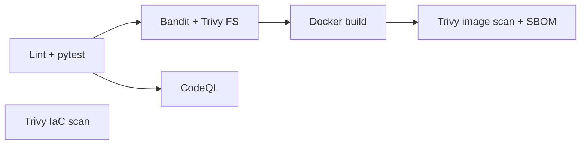

# Flask DevSecOps App

[](https://github.com/VirenSawant07/flask-app-pipeline/actions/workflows/devsecops-pipeline.yml)

This is a production-ready, security-hardened Python Flask web application complete with a 6-stage automated DevSecOps CI/CD pipeline and Infrastructure as Code (IaC) using AWS ECS Fargate and Terraform.

## Project Structure

```
├── app/                      # Flask application code
│   ├── templates/            # HTML frontend templates
│   │   └── index.html        # Premium landing page
│   ├── static/               # Static assets
│   │   └── css/style.css     # Vanilla CSS styling
│   ├── __init__.py           # App initialization
│   ├── main.py               # Routes and API endpoints
│   └── config.py             # Environment configurations
├── tests/                    # Pytest test suite
│   └── test_main.py          # Unit tests for the application
├── infra/                    # Terraform Infrastructure as Code
│   ├── main.tf               # AWS ECS, ECR, ALB, Security Groups
│   ├── variables.tf          # Terraform variables
│   └── outputs.tf            # Terraform outputs
├── .github/workflows/        # GitHub Actions CI/CD Pipeline
│   └── devsecops-pipeline.yml# 6-stage DevSecOps pipeline
├── Dockerfile                # Security-hardened Docker image build
├── requirements.txt          # Python dependencies
└── README.md                 # Project documentation
```

## Local Development

### Prerequisites
- Python 3.11
- Docker
- Terraform (for infrastructure deployment)

### Setup

1. Create a virtual environment:
   ```bash
   python -m venv venv
   source venv/bin/activate  # On Windows: venv\Scripts\activate
   ```

2. Install dependencies:
   ```bash
   pip install -r requirements.txt
   ```

3. Run the application locally:
   ```bash
   python app/main.py
   ```
   The app will be available at `http://localhost:5000`.

4. Run the test suite:
   ```bash
   pytest tests/
   ```

### Docker

To build and run the Docker image locally:
```bash
docker build -t flask-devsecops-app .
docker run -p 5000:5000 flask-devsecops-app
```

## Infrastructure

The infrastructure for AWS ECS Fargate (ECR, ALB, security groups) is defined with Terraform in the `infra/` directory. The Terraform is validated and security-scanned in CI; I haven't kept it deployed, to avoid AWS costs.

To deploy:
```bash
cd infra
terraform init
terraform plan
terraform apply
```

## CI/CD Pipeline

The GitHub Actions pipeline (`devsecops-pipeline.yml`) runs on push and pull requests to the `main` branch and consists of 6 stages:
1. **Code Setup & Tests**: Lints code and runs unit tests.
2. **SAST & Dependency Scan**: Uses Bandit and Trivy to scan for vulnerabilities.
3. **GitHub CodeQL**: Runs CodeQL static analysis.
4. **Docker Build**: Builds and saves the Docker image as an artifact.
5. **IaC Scan**: Scans the Terraform code using Trivy.
6. **Container Scan**: Scans the built Docker image using Trivy and generates a CycloneDX SBOM.



## ✅ Results
- 6-stage pipeline runs in about **2 minutes** on every push and pull request to `main`
- Code, dependencies, Terraform and the final image are all scanned; findings go to the GitHub **Security** tab, with a CycloneDX SBOM per run

## 🔒 Design decision
Scans currently **report** findings (`exit-code: 0`) instead of failing the build. Next step: fail on `CRITICAL` issues in the container scan.

## 🔭 What's next
- Fail the build on CRITICAL vulnerabilities
- Deploy automatically to ECS after a green pipeline, using GitHub OIDC (no stored AWS keys)
